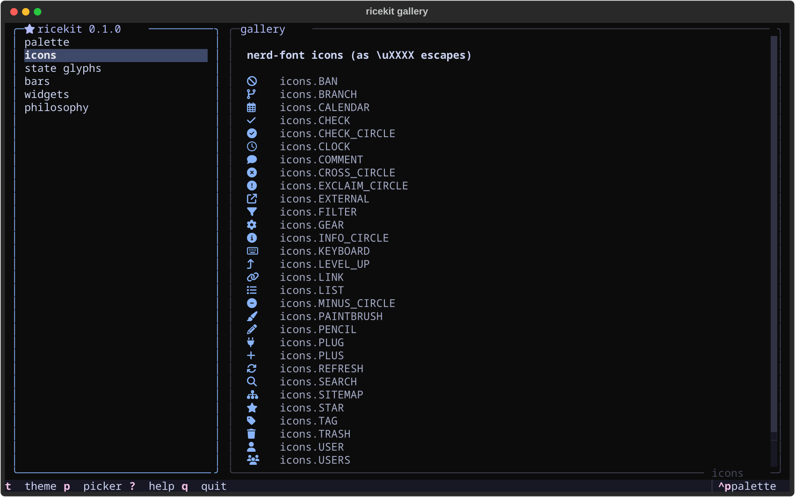

<div align="center">

# 🍚 ricekit

**A developer's TUI suite for [Textual](https://github.com/Textualize/textual).**

The themes, widgets, modals, icons, and design rules extracted from building
[ltui](https://github.com/runpantheon/ltui) — and now powering its whole family
(jtui, sctui, same repo) —
everything a fast, clean, rice-friendly terminal app needs, minus the app.



</div>

---

## what's in the box

| module | contents |
| --- | --- |
| `ricekit.themes` | five themes — `mocha`, OLED-black `void`, monochrome `onyx`, **`clear`** (transparent: your terminal's blur shows through), **`system`** (your terminal's own ANSI palette) — all sharing one `$kit-*` CSS variable contract, with the scrollbar/selection fixes baked in |
| `ricekit.palette` | swappable chrome palette (`palette.text`, `.dim`, `.blue`, …) that flips to terminal ANSI colors under the `system` theme |
| `ricekit.app` | `KitApp` — registers the themes, flips `ansi_color` for transparent themes, injects CSS variables, replaces the palette's theme command with a live-preview picker |
| `ricekit.widgets` | `NavList` (vim keys, quiet cursor), `Splitter` (drag-to-resize with persistence hook, double-click reset), `KitScroll`, `KitFooter` (self-measuring `Footer` — trims trailing keys until it fits, guaranteed zero horizontal overflow), `pop_in` (the one sanctioned animation) |
| `ricekit.modals` | `PickerModal` (generic chooser), `ThemeModal` (restyles the app live as you scroll), `HelpModal` (keybinding cheatsheet from plain data) |
| `ricekit.icons` | curated nerd-font icons as `\uXXXX` escapes + unicode state glyphs (◌ ○ ◐ ◑ ● ⊘) + mini bar gauges |
| `ricekit.fx` | text effects — the letter wave (`Wave` + `wave_markup`: **G**heat → g**H**eat → …) and braille spinner frames, driven by one cheap shared ticker |
| `ricekit.storage` | `AppDirs` — XDG state/cache/config with merge-on-save state and chmod-600 secrets |
| [`DESIGN.md`](DESIGN.md) | the philosophy: cache-first speed, shape language, color roles, motion rules — and the appendix of Textual sharp edges that each cost a day to find |

## see it

```sh
uv tool install git+https://github.com/Gheat1/ricekit
ricekit-gallery
```

The gallery demos the palette, icons, glyphs, widgets, and modals — cycle
themes with `t`, live-preview every Textual theme with `ctrl+p`, drag the
divider, press `?`.

## use it

```sh
uv add git+https://github.com/Gheat1/ricekit   # or pip install git+…
```

```python
from textual.binding import Binding

from ricekit import KitApp, icons, palette
from ricekit.storage import AppDirs
from ricekit.widgets import KitFooter, NavList

DIRS = AppDirs("myapp")

class MyApp(KitApp):
    BINDINGS = [Binding("t", "cycle_kit_theme", "theme")]
    CSS = """
    NavList { border: round $kit-border; }
    NavList:focus { border: round $kit-border-focus; }
    """

    def compose(self):
        yield NavList(id="items")
        yield KitFooter()

    def on_mount(self):
        self.init_kit(theme=DIRS.load_state().get("theme"))

    def on_kit_theme_changed(self):
        if not self.kit_theme_previewing:
            DIRS.save_state({"theme": self.theme})
```

That's a themed, transparent-capable, live-previewing app in ~25 lines.
Read [`DESIGN.md`](DESIGN.md) before building anything serious — especially
the sharp-edges table.

## the suite

- [**the tracker TUI suite**](https://github.com/runpantheon/ltui) — ltui (Linear), jtui (Jira), sctui (Shortcut); where all of this came from, now backed by Pantheon
- [**NaviTui**](https://github.com/Gheat1/NaviTui) — an animated terminal player for Navidrome, cover art and all
- yours next?

## license

[MIT](LICENSE) — made by [@Gheat1](https://github.com/Gheat1)
